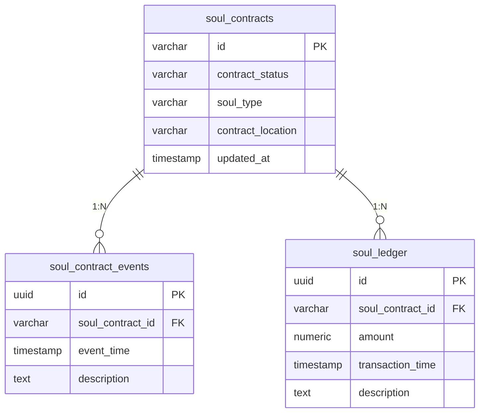
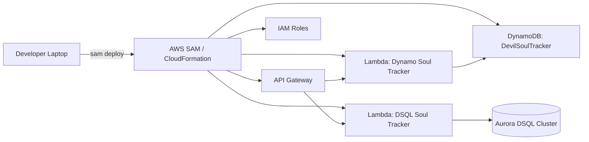
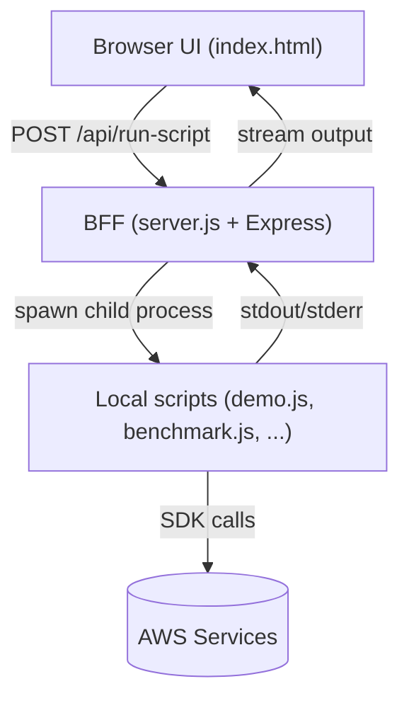

# The Devil You NoSQL

A grounded, end-to-end comparison of two ways to build the same “soul contract” domain:

- **Amazon DynamoDB** – single-table design, predictable latency, partition-local transactions.
- **Amazon Aurora DSQL** – PostgreSQL-compatible SQL with IAM auth, rich analytics, multi-table ACID.

The project ships working Lambdas, setup scripts, statistical benchmarks, and a CLI/Web experience that highlights the real trade-offs between the “devil you know” (NoSQL) and the “devil you don’t” (SQL).

---

## Stack Overview

| Layer | DynamoDB | Aurora DSQL |
|-------|----------|-------------|
| Storage | `DevilSoulTracker` single-table design | `soul_contracts`, `soul_contract_events`, `soul_ledger` |
| Access | Lambda (`src/dynamoSoulTracker.ts`) | Lambda (`src/dsqlSoulTracker.ts`) |
| Auth | SigV4 | IAM auth token (`@aws-sdk/dsql-signer`) |
| Scripts | `seedData.js`, `demo.js`, `benchmark.js` | same |
| UX | `index.html` + `server.js` CLI endpoints |

Both sides receive identical datasets via the setup/seeding workflow so demos and benchmarks operate on parity data.

---

## Data Models at a Glance

### DynamoDB Single-Table Layout

| PK            | SK                        | GSI1PK             | GSI1SK             | Core Attributes                                                     |
|---------------|---------------------------|--------------------|--------------------|---------------------------------------------------------------------|
| `SOUL#<id>`   | `CONTRACT`                | `STATUS#<status>`  | `<updated_at ISO>` | `status`, `soul_type`, `contract_location`, `updated_at`, `createdAt` |
| `SOUL#<id>`   | `EVENT#<timestamp>`       | `EVENT#<date>`     | `<timestamp ISO>`  | `description`, `eventType`, `timestamp`                              |
| `SOUL#<id>`   | `LEDGER#<timestamp>`      | `LEDGER#<date>`    | `<timestamp ISO>`  | `amount`, `description`, `timestamp`                                 |

- All records for a soul share the same partition key (`PK = SOUL#<id>`).
- Sort keys encode item type and chronological ordering (`CONTRACT`, `EVENT#`, `LEDGER#`).
- A single GSI (`STATUS#`, `EVENT#date`, `LEDGER#date`) backs alternate read patterns.

### Aurora DSQL Normalized Schema



- Contract state lives in `soul_contracts`.
- Every change/event and ledger movement is an independent row with foreign-key back to the contract.
- Complex analytics (ranking, window functions) operate directly on these normalized tables.

---

## Deployment Architecture

### Backend (Infrastructure-as-Code via SAM + Manual DSQL Provisioning)



- CloudFormation (SAM) deploys API Gateway, both Lambdas, DynamoDB table, and IAM roles.
- Aurora DSQL cluster must exist already; setup scripts create tables/indexes and seed data.
- Lambdas are invoked through API Gateway for programmatic comparisons (optional in demo).

### Front-End / BFF (Browser ↔ Express ↔ Local Scripts)



- `npm run server` starts Express on `localhost:3000`.
- The browser triggers local scripts (demo, benchmark, etc.) via REST endpoints.
- Scripts use AWS SDK and IAM auth to reach DynamoDB and Aurora DSQL.
- STDOUT/STDERR is streamed back to the browser for real-time logs.

---

## Repository Structure (2025-02)

```
devil-you-nosql/
├── index.html              # Web UI (Operations + Benchmark tabs)
├── server.js               # Express shim to run Node scripts from the browser
├── scripts/
│   ├── benchmark.js        # Rigorous benchmark runner (5 scenarios)
│   ├── checkParity.js      # DynamoDB vs DSQL result comparison
│   ├── createDsqlIndexes.js
│   ├── createSoulTrackerTables.js
│   ├── demo.js             # Main philosophy demo (reads + writes + analytics)
│   ├── seedData.js         # Configurable data generator (small/large)
│   ├── setup.js            # One-button setup (tables, indexes, small seed, validate)
│   ├── validate.js         # Cross-database validation
│   └── verifyDatabases.js  # Connectivity + schema checks
├── src/
│   ├── dynamoSoulTracker.ts
│   └── dsqlSoulTracker.ts
├── template.yaml           # SAM template (Lambda + API Gateway + DynamoDB + VPC hooks)
├── package.json            # NPM scripts, dependencies
├── samconfig.toml          # Optional SAM defaults
└── README.md               # You are here
```

Generated artefacts (`dist/`, `node_modules/`) are omitted above.

---

## Prerequisites

- Node.js **20+**
- AWS CLI credentials with rights to create DynamoDB tables, Lambda, API Gateway, IAM roles, and connect to your Aurora DSQL cluster
- **SAM CLI** (`sam --version` should work)
- An **Aurora DSQL** cluster (Preview) – capture its endpoint
- Environment variables when running scripts:
  ```bash
  export AWS_REGION=us-east-1          # or your region
  export DSQL_ENDPOINT=xxxxxxxxxx.dsql.us-east-1.on.aws
  ```

> ⚠️ CloudFormation cannot create Aurora DSQL tables yet. You must run the setup scripts after SAM deploys the cluster.

---

## Installation & Setup

1. **Install dependencies**
   ```bash
   npm install
   ```
2. **Deploy baseline infrastructure** (optional but recommended)
   ```bash
   sam build --template-file template.yaml
   sam deploy --guided --stack-name devil-you-nosql
   ```
   This provisions the Lambdas, API Gateway, DynamoDB table, roles/VPC attachments. Aurora DSQL is expected to already exist (the template can import an existing cluster endpoint).
3. **Run the setup pipeline** (creates DSQL tables, indexes, seeds small dataset)
   ```bash
   npm run setup              # -> node scripts/setup.js
   ```
   Behind the scenes:
   - Creates `soul_contracts`, `soul_contract_events`, `soul_ledger`
   - Adds async indexes (if absent)
   - Seeds a **small dataset** (10 souls / 100 events / 50 ledger entries)
   - Verifies the two databases
4. *(Optional)* **Seed the larger dataset** when you want stress numbers
   ```bash
   npm run seed:large         # 1000 souls / 50k events / 5k ledger entries
   ```
   Large seeding automatically chunks DSQL writes into sub‑3k-row transactions.

---

## NPM Scripts

| Script | Action |
|--------|--------|
| `npm run setup` | `scripts/setup.js` – tables, indexes, small seed, validate |
| `npm run demo` | `scripts/demo.js` – full read/write demo with statistics |
| `npm run seed` | alias for small seed (`--souls 10 --events 10 --ledger 50`) |
| `npm run seed:large` | large workload seed (chunked DSQL transactions) |
| `npm run verify` | `scripts/verifyDatabases.js` |
| `npm run validate` | `scripts/validate.js` |
| `npm run benchmark` | `scripts/benchmark.js` CLI runner |
| `npm run server` | launches `server.js` (express wrapper for web UI) |
| `npm run check:parity` | Compare DynamoDB vs DSQL results for sampled souls |

---

## Web Experience (`index.html` + `server.js`)

Start the local server:
```bash
npm run server
# open http://localhost:3000
```

Tabs:

1. **Operations** – Buttons to run setup, verify, seed, and validate scripts.
2. **Benchmark** –
   - “Run Showcase Demo” → executes `scripts/demo.js`
   - “Run Benchmark Suite” → executes `scripts/rigorousContrastBenchmark.js` with configurable iterations
   - “View Benchmark History” → fetches saved benchmark logs (if any) from `server.js`

The UI streams terminal output so you see the same statistical summaries the CLI prints: latency distributions, CV%, t-tests, audit logs, etc. Configuration fields were intentionally removed; the server uses `DSQL_ENDPOINT` and `AWS_REGION` from your environment.

---

## Demo Walkthrough (`scripts/demo.js`)

The showcase demo is intentionally noisy—it performs the real operations and prints the measured stats. Major segments:

1. **Scenario 1 – User profile fetch (“complete soul profile”)**
   - DynamoDB: partition query returning contract + events + ledger entries (~50 items)
   - DSQL: contract row + event rows + ledger rows fetched separately to mimic Dynamo output
   - Stats: mean latency, min/max, P95, std dev, CV, t-test & effect size
   - Sample output: lists each DynamoDB item (SK order) plus a normalized DSQL item list.

2. **Scenario 2 – Analytics (“executive dashboard”)**
   - DSQL: CTE + aggregations for location-based metrics (soul count, redemption rate, per-soul power)
   - DynamoDB: iterates over locations, writes per-soul totals, aggregates client-side
   - Displays both result sets and timing comparison

3. **Scenario 3 – Write transaction**
   - DynamoDB: `TransactWriteCommand` (update + event insert + ledger insert)
   - DSQL: explicit `BEGIN`/`COMMIT` plus individual statements
   - Outputs post-transaction partition scan (Dynamo) and lateral audit (DSQL)
   - Summarises measured times and relative gap instead of static prose

4. **Batch operations comparison**
   - DynamoDB `BatchGet` vs per-item `Get`
   - DSQL `IN (...)` batching vs parallel single-row selects
   - Each dataset printed afterward for parity checking

5. **Complex analytics**
   - DSQL CTE with window functions for risk analysis (net power, activity, ranking)
   - DynamoDB version **disabled**: the script now logs that client-side replication is impractical and points to the commented prototype. (We left the exploratory code in comments for future reference.)

6. **Summary**
   - “Decision matrix” comparing DynamoDB vs DSQL depending on latency sensitivity, flexibility, costs, etc.

> ℹ️ The demo intentionally uses `process.hrtime.bigint()` for sub-millisecond timing and recalculates stats on every run. Expect numbers to change between executions.

---

## Operation Notes

- **Transaction chunking** – `seedData.js` automatically commits after ~3,000 DSQL rows to respect Aurora DSQL limits.
- **Index validation** – `validate.js` recognises both traditional index names and async index names (e.g., `ix_events_scid`).
- **Parity checker** – `checkParity.js` samples N souls, compares contracts/events/ledger counts, and reports differences with exit code `1` on mismatch.
- **Complex Dynamo analytics** – left intentionally disabled in the demo output to avoid long runtimes; the exploratory logic (looping over partitions, aggregating events/ledger in JS) remains in comments for future work.
- **Web UI** – scripts are run locally through `server.js`; nothing is deployed publicly.

---

## Installing & Running Benchmarks Manually

```bash
# Run the main showcase demo
npm run demo

# Execute full benchmark suite with default iterations
node scripts/rigorousContrastBenchmark.js

# Custom iteration count (e.g., 25 runs per scenario)
node scripts/rigorousContrastBenchmark.js 25
```

Benchmark scenarios:
1. User profile retrieval
2. Location analytics
3. Batch contract fetch
4. Transactional write bundle
5. Complex analytics (CTE + window functions)

Each scenario records DynamoDB vs DSQL timings, prints stats, and saves history through `server.js` when invoked from the UI.

---

## Troubleshooting

| Symptom | Likely Cause | Remedy |
|---------|--------------|--------|
| `ReferenceError: DSQL_ENDPOINT is not defined` | Env var missing | `export DSQL_ENDPOINT=...` before running scripts |
| `Transaction row limit exceeded` | Long DSQL transaction | Ensure you’re on latest `seedData.js` (auto-chunking). Re-run seed. |
| Demo stalls during “complex analytics” | (Resolved) DynamoDB client-side analytics removed | Update repo; rerun demo. |
| Web UI says “Failed to connect to local server” | `npm run server` not running | Start the Express server; keep shell open |
| Parity checker reports mismatches | Databases out of sync | Re-run `npm run setup` or `npm run seed` to reset data |

---

## Contributing

1. Fork & clone
2. Install (`npm install`)
3. Run lint/tests (not included yet—PRs welcome!)
4. Submit PR with clear description + before/after output when applicable

---

## License

[MIT](LICENSE)
